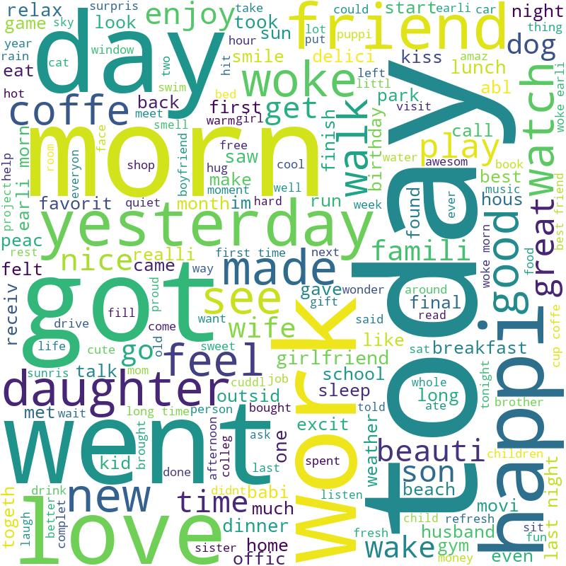

# Applied Data Science @ Columbia
## Spring 2024
## Zichen Zhao (UNI: zz3119)
## Project 1: Use of Words across Age Span in the United States




### [Project Description](doc/Proj1_desc.md)
This is the first and only *individual* (as opposed to *team*) this semester. 

Term: Spring 2024

+ Project title: What Made Me Happy Today? Use of Words across Age Span in the United States
+ This project is conducted by Zichen Zhao

+ Project Goal:
1. remove all the stopping words and normalize the age frame
2. Focus on individuals from the US and divide genders into males and females
3. Merge the dataset between demography and cleaned_hm. 
4. Calculate the percentage of frequency on use of sentiment words based on males and females.
5. Extract word frequency based on sentiment words by percentage of frequency and set target words.
6. Line-chart visualization on frequency of words by age between male and female. 
7. Insights from some target words according to certain ages

+ Project summary:
This report presents a detailed sentiment analysis aimed at understanding the differences in sentiment word usage across different lifespan segments between males and females in the United States. The analysis is grounded in a thorough examination of the dataset and the distribution of word frequencies, revealing nuanced patterns in language use related to age and gender. Key findings from the study are summarized as follows:
1. Age-Related Patterns in Word Usage: The analysis identifies age 40 as a pivotal point marking significant shifts in word usage frequencies between younger and older cohorts. This age milestone delineates differing linguistic expressions of sentiment, suggesting a potential influence of life stage on sentiment expression.
2. Gender Disparities in Sentiment Words Pre-40: Prior to the age of 40, there is a pronounced disparity in the sentiment words predominantly used by males and females. Males are more likely to use words such as "amazed," "anger," "appreciative," "attracted," "blind," "chances," "comedian," "cutting," and "definite." Conversely, females frequently use words like "comforter," "cried," "desperate," "determination," and "kiss." This disparity highlights a gendered difference in expressing sentiments, with males and females gravitating towards different lexical choices to articulate their feelings and experiences.
3. Post-40 Surge in Male Word Usage: Among males, there is a notable increase in the usage of specific words after the age of 40, including "delay," "delectable," "delight," "died," "disappointed," "efficient," "energetic," "errors," and "frustration." This surge reflects a shift in sentiment expression that may be associated with mid-life experiences and perspectives.
4. Post-40 Surge in Female Word Usage: Similarly, females exhibit a distinct increase in the use of certain words post-40, such as "disorder," "dream," "ease," "giggling," "grace," "hugged," "limited," and "lonely." This change suggests a nuanced evolution in how females articulate sentiments as they transition into later life stages, possibly reflecting differing emotional landscapes and life experiences.
These findings underscore the complexity of sentiment expression as influenced by gender and age, pointing to the importance of considering these factors in linguistic and psychological research. Further analysis is required to delve deeper into the underlying causes and implications of these patterns, which may inform interventions and supports tailored to different demographic groups.

+ Potential Strengths
1. The analysis provides valuable insights into how gender influences sentiment expression, potentially enriching our understanding of gender-specific communication styles, emotional expression, and psychological states. This can inform gender-sensitive psychological therapies and interventions.
2. Identifying age 40 as a pivotal point for shifts in sentiment expression offers a nuanced understanding of life stage transitions and their impact on emotional well-being and communication. This could be instrumental in developmental psychology, helping to tailor interventions that address mid-life crises or transitions.
3. The study's focus on the U.S. population offers culturally specific insights that can inform social science research related to American societal norms, values, and emotional expression patterns. This could be valuable in cross-cultural studies comparing sentiment expression across different societies.

+ Limitations
1. Sentiment analysis primarily focuses on the presence of specific words, which may overlook the contextual nuances that give meaning to those words. This could lead to misinterpretations of the sentiments actually intended by the individuals.
2. Focusing exclusively on the U.S. limits the generalizability of the findings to other cultures. Emotional expression and sentiment word usage can vary significantly across different cultural backgrounds, affecting the applicability of the insights globally.
3. While sentiment analysis excels at identifying quantitative patterns in word usage, it may miss qualitative aspects of sentiment expression, such as intensity, sincerity, and the complexity of emotions that are not easily captured through word frequency alone.

Following [suggestions](http://nicercode.github.io/blog/2013-04-05-projects/) by [RICH FITZJOHN](http://nicercode.github.io/about/#Team) (@richfitz). This folder is orgarnized as follows.

```
proj/
├── lib/
├── data/
├── doc/
├── figs/
└── output/
```

Please see each subfolder for a README file.
