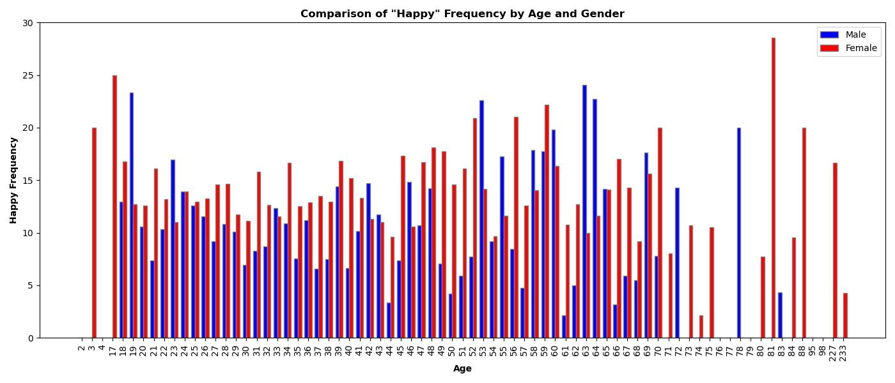

# ADS Project 1: What made you happy today?
### Figs folder

This folder includes a folder named word_frequency_compare which compares male and female word frequency across the United States for each age value

Here's an example of the image in this folder (using words 'happy'):

